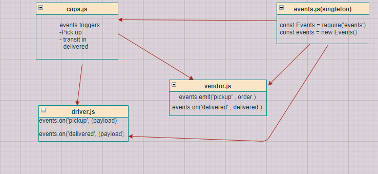

# lab11-events

## Events-Driven Programming
* Author : MARAM
* Setup : .env =>{
    store name,
    address,
    customer name,
    order id
}
* Running the app : npm start
* Test : using jest >> npm test
* 